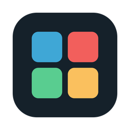
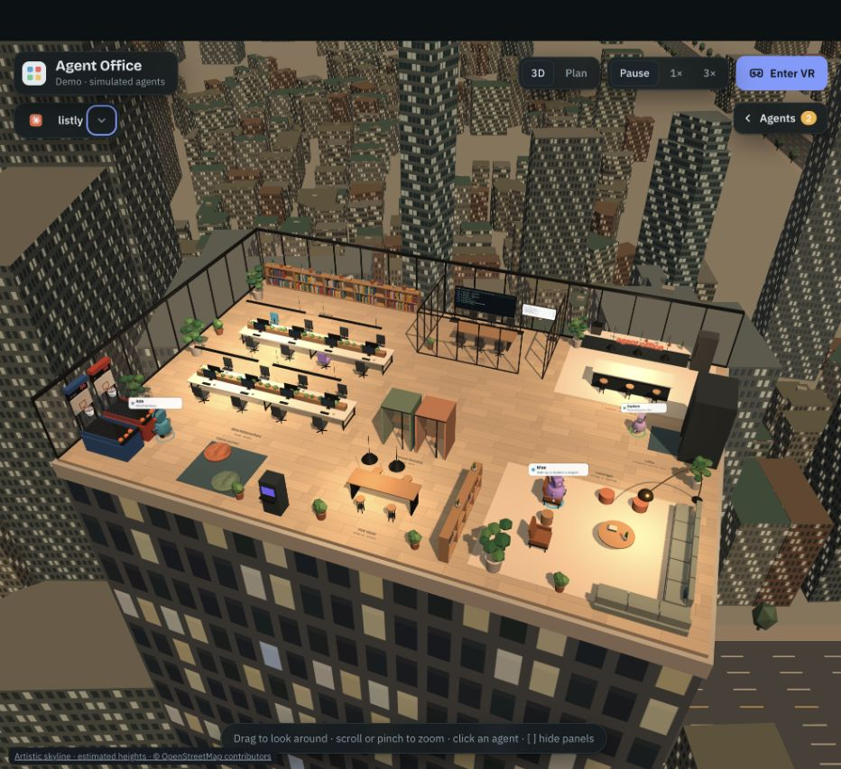
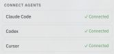
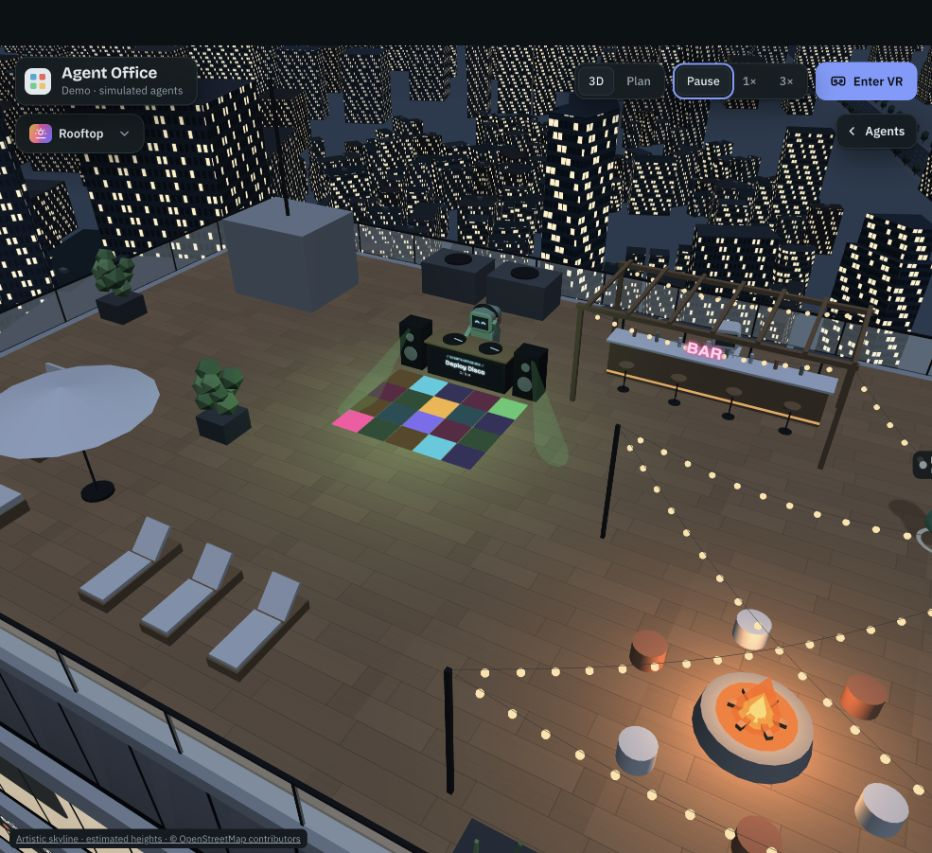

#  Agent Office

A 3D office where your Claude Code agents work. Every session you run in the **Claude desktop app** or in the **terminal** becomes an agent that rides up in the lift, takes a desk, walks to the library when it researches, raises a hand when it needs your permission, and heads to the lounge when it's done. Subagents show up as smaller teammates.

Works in any browser on your computer. Phone and VR headset support comes next (see the roadmap).



*The office in demo mode, with fictional projects and the artistic Seoul skyline.*

> **Preview.** Agent Office is early and Mac-first. The desktop app is ad-hoc signed and not notarized, so macOS may ask you to allow it once (see [first-launch instructions](INSTALL.md#allow-the-first-launch)). **Open chat** relies on how the Claude and Codex apps open their chats today; that isn't documented by either app and could change, in which case the button still brings the app forward. Issues and ideas are welcome.

## Quick start

**On a Mac:** download the DMG from the [latest release](https://github.com/regisBafutwabo/agent-office/releases/latest) and drag **Agent Office** to **Applications**. Open it once. If macOS blocks it, go to **System Settings → Privacy & Security → Security → Open Anyway**, then confirm **Open**. Click **Connect Claude Code** in the app. See the [step-by-step first-launch instructions](INSTALL.md#allow-the-first-launch).



*Customize → Connect agents after setup. Each Connect button installs that tool's hooks; start a new agent session afterward.*

Full setup, including building from source and troubleshooting, is in **[INSTALL.md](INSTALL.md)**. From source, the short version is:

```bash
git clone https://github.com/regisBafutwabo/agent-office.git
cd agent-office
npm install
npm start                # starts the office at http://localhost:4747
```

Then install the hooks once, so Claude Code reports what it's doing:

```bash
claude plugin marketplace add "$(pwd)"
claude plugin install agent-office@agent-office
```

Open a **new** Claude Code session (desktop app or terminal) and send a prompt. Its agent appears in the office.

To try it without Claude Code, open <http://localhost:4747/?demo> for simulated agents.

## Other coding agents

Codex CLI, Cursor, Gemini CLI, GitHub Copilot CLI, Qwen Code, Factory Droid, Goose, Kiro, Windsurf, Cline, OpenCode and Amp can report to the office too, through `adapters/hook.sh`. The desktop app connects Codex and Cursor in one click (**Connect agents** in the menu bar or in Customize). Setup for the others is in [docs/adapters.md](docs/adapters.md). Works with both the desktop app and `npm start`.

## Desktop app (macOS)

A 4 MB menu-bar app with the office server built in, so you don't need `npm start` or Node:

- The menu-bar icon shows how many agents need you, and macOS notifies you when one asks for permission.
- **Connect agents** installs the Claude Code plugin and adds Codex or Cursor hooks in one click, so you don't need this repo. Newer app versions update the plugin by themselves.
- **Open Agent Office** shows the 3D office in a window. Closing the window frees its memory; the server keeps running in the menu bar until you quit.
- Phones and browsers can still open <http://localhost:4747>.

Build it (needs Rust: `brew install rustup && rustup default stable`):

```bash
cd desktop
npm install
npm run dev      # run it
npm run build    # Agent Office.app and a .dmg in src-tauri/target/release/bundle/
```

The app is ad-hoc signed and not notarized, so other Macs may warn that the developer can't be verified. Follow the [first-launch instructions](INSTALL.md#allow-the-first-launch).

## How it works

```
Claude Code (desktop app / terminal)
   │  hooks from the agent-office plugin (plugin/hooks)
   ▼
bridge/server.js  ── keeps live state of every session and subagent
  (or the desktop app's built-in Rust server: desktop/src-tauri)
   │  WebSocket
   ▼
web/index.html    ── the 3D office (Three.js)
```

- The plugin's hook script posts each event to `http://127.0.0.1:4747/hook`. It gives up after one second and never blocks or changes what Claude Code does.
- The bridge only listens on `127.0.0.1`, so nothing leaves your machine. Prompts and file names are shown in the office, so treat it like your terminal.
- Where agents go is decided by placement rules in `web/index.html` (search for "Placement rules"): three or more file reads in a row send an agent to the library, web research goes to the lounge, plan mode goes to the war room, and finished agents take a break after 45 seconds and then drift between the lounge, coffee bar, ping-pong and the rooftop. Agents look around, stretch and sip coffee while they work.

## Characters

Agents are small robots with a screen for a face, and the face shows what the agent is doing: eyes looking up with "…" while thinking, focused while working, a big "!" when it needs you, happy ^ ^ when done, sleepy zZ when idle, and a frown when something failed. A light on the chest shows the same status color.

Customize each agent in **Customize → Agents**: body shape, face style, colors, and accessories (headphones, beanie, cap, glasses, antenna, scarf, backpack, mug). Looks are remembered per project. Subagents automatically look like a smaller "intern" version of their parent, and agents from other tools get a default accessory (Cursor wears headphones, Codex a cap, and so on). Try looks side by side in `prototype/character-lab.html`.

## Day and night

The office follows your clock by default (**Customize → Office theme → Auto**): night until 5:00, dawn into daylight by 8:00, daylight until 17:00, then golden hour and night by 20:00. Colors and light blend through the transitions, the sun crosses the sky during the day, and the city lights come on at dusk. Pick any other theme to keep it fixed; your choice is remembered.

Choose **Seoul**, **San Francisco**, or **Generic city** on your first visit, or change it under **Customize → City**. City views combine bundled OpenStreetMap footprints with stylized landmarks and artistic scenery, with windows that light up at night. Your choice is saved on this device. See [the city data notes](web/cities/README.md) to change the office centers and rebake the snapshots.

## Rooftop DJ



The rooftop DJ plays what you're listening to. On a Mac, the office asks the Spotify app for its current song, then Apple Music, and shows it on the front of the DJ booth. With your music on, the DJ plays by day too; the full party (lights, fire, bar) still waits for dark. With nothing playing, the DJ spins its own office mix of made-up tracks.

It only checks while an office page is open, never opens Spotify or Music, and nothing leaves your machine. macOS asks once whether Agent Office (or your terminal, with `npm start`) may control Spotify or Music; to change that later, go to **System Settings → Privacy & Security → Automation**. The dance floor keeps its own beat, because Spotify no longer shares a song's tempo.

## Jumping to an agent's chat

Every live agent has an **↗** button in the agent list, and an **Open chat** / **Open in …** button on its card. When an agent finishes, a toast pops up with the same button, so one click takes you back to it.

- **Claude desktop app:** opens that exact chat (the plugin passes the app's session id; needs plugin 0.4.0).
- **Codex app:** opens that exact thread.
- **Terminal and iTerm:** selects the tab running that session.
- **Cursor, VS Code, Windsurf, Zed:** opens that project's window, where its agent chat lives.
- **Anything else on the list:** brings the app forward.

The desktop app asks once for permission to control Terminal or iTerm. It only ever opens apps from a fixed list of coding tools, and chat links are built from validated ids only (see `desktop/src-tauri/src/focus.rs`), on macOS.

## App logos

Floors and agents show the logo of the tool they come from (Claude, Codex, Cursor…) in the Floors list, the agent list and on the floor signs. The logos are the real icons of the apps installed on your Mac, read from macOS by the local office, so no artwork ships with this repo. Tools without an installed app, and the claude.ai preview, show a lettered badge.

## Approving from the office

When an agent needs permission, it raises its hand and its floor pulses amber. If the office is open on your screen, you can answer right there: **Allow**, **Deny**, or **Answer in Claude Code**. You can do this from the agent's card or from the pop-up alert.

- Claude Code runs its permission hook *before* showing its own dialog. So the office only holds a request while at least one office page is visible, and for at most 45 seconds. After that, or if nobody is watching, Claude Code asks you as usual with no delay.
- Denied requests tell Claude "Denied from Agent Office", so it can try another way.
- Only pages served by the office itself can connect. Requests from other websites are refused, so a web page can't approve commands on your machine.

This works with Claude Code today. Codex, Copilot CLI, Gemini CLI, Cursor and Factory hooks can also allow or deny, so they can be added the same way.

## Options

| Setting | Default | What it does |
|---|---|---|
| `AGENT_OFFICE_PORT` | `4747` | Port for the bridge. Set it for Claude Code too if you change it, since the hook script reads it. |
| `AGENT_OFFICE_HOST` | `127.0.0.1` | Interface the bridge listens on. |
| `?demo` | | Simulated agents instead of live sessions. |
| `?fast` | | Shorter idle timers, useful when testing. |
| `?time=18:45` | | Preview the **Auto** theme at another hour. |

## Uninstall the hooks

```bash
claude plugin uninstall agent-office@agent-office
claude plugin marketplace remove agent-office
```

## Development

```bash
npm test                                  # bridge and city bake unit tests
(cd desktop/src-tauri && cargo test)      # desktop app server tests
claude --plugin-dir ./plugin              # try the hooks in one session without installing them
```

## License

[MIT](LICENSE). Agent Office isn't affiliated with Anthropic, OpenAI, Cursor or the other tools it works with. App logos in the office are read from the apps installed on your Mac, not shipped with this repo.

## Roadmap

1. ~~Live sessions from the desktop app and terminal (read-only)~~
2. ~~Approve or deny permission requests from the office, desktop notifications~~
3. Phone and VR over your local network (HTTPS for WebXR)
4. Give agents tasks from the office (sessions started through the Agent SDK)
5. ~~Desktop app (Tauri) with a menu-bar icon~~; custom 3D model packs and code signing next
